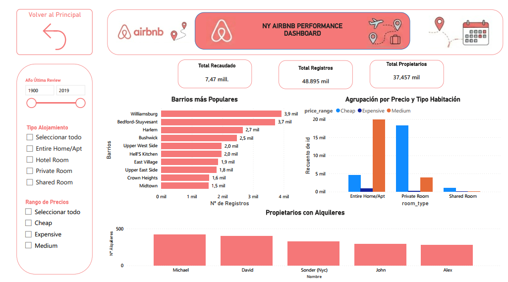
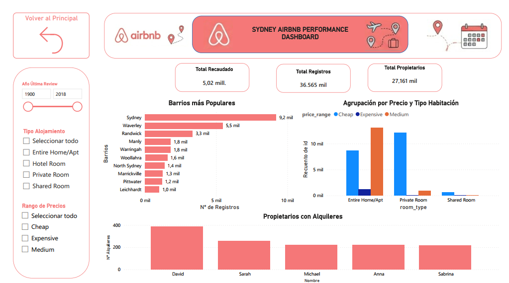
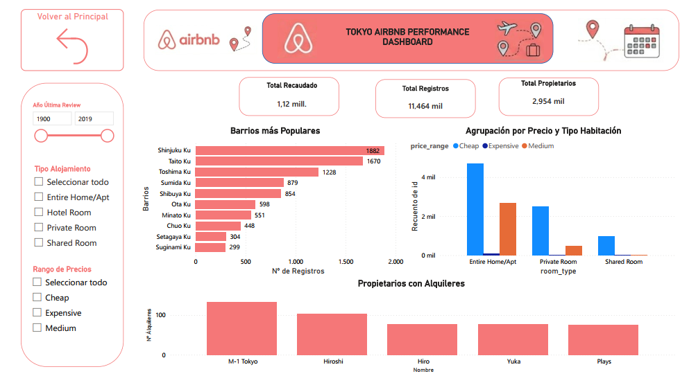

# DA_proyect_Analisis_PowerBI_grupo3
# 📊 Proyecto de Análisis de Datos: Airbnb Performance

## 📋 Descripción del Proyecto
Este proyecto consiste en la unificación, limpieza profunda y modelado de datos de reservas de Airbnb en 6 ciudades globales clave: London, Madrid, Milan, New York, Sydney y Tokyo. El objetivo principal fue consolidar archivos independientes en un modelo de datos optimizado bajo la arquitectura de **Estrella (Star Schema)** para garantizar un rendimiento eficiente y facilitar la posterior creación de dashboards en Power BI.

---

## 🎯 Objetivos del Proyecto e Hipótesis de Negocio

El desarrollo de este modelo de datos y sus posteriores dashboards interactivos se diseñó con el fin de responder a los siguientes objetivos estratégicos y validar tres hipótesis clave del mercado inmobiliario turístico:

### 1. Rentabilidad por Tipo de Alojamiento (`Room Type` vs. `Precio Promedio`)
* **Objetivo**: Evaluar qué tipologías de habitaciones generan mayor rentabilidad económica dentro de la plataforma.
* **Hipótesis**: Los precios por noche de los **apartamentos/casas completos** (`Entire home/apt`) son significativamente superiores en comparación con las **habitaciones privadas** (`Private room`), justificando la concentración de la oferta en esta categoría.

### 2. Brecha de Precios Intercontinental (`Ciudades Globales` vs. `Ciudades Europeas`)
* **Objetivo**: Cuantificar las diferencias de precio medio por noche entre los distintos mercados geográficos analizados.
* **Hipótesis**: El precio medio de los alquileres en grandes urbes y capitales financieras globales como **Nueva York y Londres** es drásticamente mayor en comparación con destinos culturales y turísticos europeos tradicionales como **Madrid o Milán**.

### 3. Análisis de Densidad Territorial y Concentración Geográfica (`Barrios`)
* **Objetivo**: Identificar patrones de distribución espacial de las propiedades disponibles para entender la saturación del mercado.
* **Hipótesis (Principio de Pareto)**: El **80% de la oferta total** de alojamientos se concentra estrictamente en los barrios correspondientes al **centro histórico y zonas turísticas neurálgicas** de cada ciudad, dejando las zonas periféricas o residenciales prácticamente desiertas.

---

## 🛠️ Tecnologías Utilizadas
* **Power BI / Power Query**: Extracción, transformación, carga (ETL) y modelado de datos.
* **Formatos de Origen**: Archivos de texto plano (.CSV).
* **Markdown**: Documentación del proyecto.

---

## 🔄 Proceso de ETL (Extracción, Transformación y Carga)

El ciclo de vida de los datos se dividió en dos fases críticas dentro de Power Query: la homogeneización de las fuentes individuales y la posterior estructuración de la tabla central de hechos.

### 1. Limpieza y Homogeneización de Orígenes (CSV Individuales)
Antes de la consolidación, cada archivo por ciudad (`london_airbnb`, `madrid_airbnb`, etc.) pasó por el siguiente tratamiento de calidad de datos:
* **Corrección estructural**: Eliminación de saltos de línea ocultos que corrompían las filas y el parsing de los archivos CSV originales.
* **Normalización financiera**: Conversión y estandarización de las monedas en la columna `price` a una escala homogénea.
* **Trazabilidad**: Creación de la columna descriptiva `city` en cada archivo de origen antes de realizar la unión.
* **Imputación de ausencias**: Manejo de valores nulos en fechas críticas asignando de forma temporal el año por defecto `1990` para evitar la pérdida de registros.

### 2. Pasos Aplicados en la Tabla Central (`Facts_airbnb`)
Una vez realizada la combinación de todas las ciudades con sus formatos y columnas sincronizadas, se ejecutó la siguiente secuencia de transformación en Power Query (según el histórico del editor):

* **Origen y Reemplazo**: Carga de la combinación inicial y ejecución de la sustitución de valores inconsistentes (`Valor reemplazado`).
* **Tratamiento de Texto**: 
  * Aplicación de mayúsculas en la primera letra de cada palabra (`Poner En Mayúsculas Cada Palabra`).
  * Limpieza de espacios en blanco innecesarios al inicio y final de las cadenas (`Texto recortado`).
  * Eliminación de caracteres invisibles o basura de los campos de texto (`Texto limpio`).
* **Enriquecimiento**: Incorporación de lógicas personalizadas y reglas de negocio mediante los pasos `Personalizada agregada` y `Columna condicional agregada`.
* **Construcción del Star Schema (Cruces)**:
  * Combinación y expansión sucesiva de las dimensiones externas para heredar únicamente las claves subrogadas/IDs necesarios (`Dim_City`, `Dim_RoomType`, `Dim_Date`, y `Dim_Neighbourhood`).
* **Depuración Final**:
  * **Columnas quitadas**: Eliminación definitiva de las columnas de negocio redundantes o fuera de alcance para optimizar el rendimiento (`neighbourhood_group`, `calculated_host_listings_count` y `availability_365`).
  * **Columnas con nombre cambiado**: Renombrado técnico de campos para asegurar un modelo autoexplicativo y fácil de leer.
  * **Redondeado**: Formateo numérico final de métricas y precios para su correcto almacenamiento y visualización.

---

## 📐 Modelado de Datos (Star Schema)

Para garantizar un rendimiento óptimo en las consultas del reporte, se transformó la estructura plana original en un **Modelo en Estrella**:

<pre>
        🌐 [Dim_City]           🛏️ [Dim_RoomType]
              \                       /
               \                     /
         ======[   Facts_Airbnb   ]======
               /                     \
              /                       \
        📅 [Dim_Date]           🏡 [Dim_Neighbourhood]
                             (Incluye Dim_Host)
</pre>

### Extracción de Dimensiones
Se aislaron las entidades del negocio eliminando estrictamente los registros duplicados para generar tablas de dimensiones con claves primarias únicas:

* **`Dim_City`**: Atributos `id_city` y `city` (Mapeo de las 6 ciudades europeas).
* **`Dim_RoomType`**: Atributos `room_type_id` y `room_type`.
* **`Dim_Neighbourhood`**: Atributos `neighbourhood_id` y `neighbourhood`.
* **`Dim_Host`**: Centralización de los identificadores de los anfitriones.
* **`Dim_Date`**: Tabla de tiempo construida a partir de la columna única `last_review`.
---

## 📊 Visualización de Datos (Dashboard en Power BI)

### 🖥️ Dashboard Principal: Análisis Global de Mercado
El informe cuenta con un diseño intuitivo orientado al usuario de negocio, utilizando la paleta de colores corporativa de Airbnb. Incluye filtros interactivos por **Año de Última Review**, **Tipo de Alojamiento** y **Rango de Precios (Cheap, Medium, Expensive)**, además de un menú de navegación lateral para filtrar por ciudades específicas.

#### 📈 KPIs e Indicadores Clave Visibles:
* **Total Recaudado**: `31.93 Millones`
* **Total Registros**: `219,922 mil`
* **Total Anfitriones**: `144,448 mil`
* **Total Ciudades**: `6`

#### 📊 Análisis de los Gráficos Principales:
1. **Registros por Ciudad (Gráfico de Columnas)**: Distribución del volumen total de propiedades disponibles por mercado geográfico (Londres, NY, Sydney, Madrid, Milán, Tokyo).
2. **Precio Promedio por Ciudad (Gráfico de Anillo)**: Comparativa visual del costo medio por noche en cada una de las 6 ciudades analizadas.
3. **Anfitriones con más Alquileres - Top 10 (Gráfico de Columnas)**: Identificación de los principales "súper anfitriones" o cuentas con mayor volumen de propiedades listadas en la plataforma.

---

### 🗺️ Reportes Detallados por Ciudad
El informe se divide en pestañas específicas para un análisis en profundidad de cada mercado local:

#### 📍 Análisis del Mercado: Londres

Exploración del mercado con mayor volumen de datos del proyecto. Muestra la concentración de alojamientos en zonas de alta demanda turística como Westminster y Tower Hamlets, evaluando el impacto económico de los anfitriones top.

#### 📍 Análisis del Mercado: Madrid

Análisis detallado del mercado español centrado en la almendra central de la capital (p. 2). Destaca el volumen de registros en barrios emblemáticos como Embajadores y Universidad, junto con la distribución de ingresos según el tipo de propiedad.

#### 📍 Análisis del Mercado: Milán

Panel enfocado en la capital de la moda y el diseño italiano (p. 5). Analiza la oferta de alquileres en zonas cotizadas como Buenos Aires - Venezia y Duomo, segmentando los registros por rangos de precio e ingresos estimados.

#### 📍 Análisis del Mercado: New York

Radiografía estadística del ecosistema de alojamiento en Nueva York (p. 6). Evalúa la densidad de ofertas en vecindarios históricos como Williamsburg y Bedford-Stuyvesant, visibilizando la relación entre precios y tipo de hospedaje.

#### 📍 Análisis del Mercado: New York

Gráfico del mercado inmobiliario turístico en la costa australiana (p. 7). Destaca la relevancia de las zonas costeras y céntricas como Sydney y Waverley, midiendo la reputación de los propietarios con más alquileres activos.

#### 📍 Análisis del Mercado: New York

Vista analítica del comportamiento de Airbnb en el mercado asiático (p. 3). Permite identificar las tendencias de reserva en distritos clave como Shinjuku y Taito, contrastando la oferta entre habitaciones privadas y departamentos completos.

---

## 🎯 Conclusiones del Análisis de Negocio

**Hipótesis 1:** Rentabilidad por Tipo de Alojamiento
Pregunta: ¿Los apartamentos completos (Entire home/apt) generan precios significativamente superiores a las habitaciones privadas (Private Room)?

**Resultado:** SÍ, se cumple parcialmente, pero depende fuertemente de la ciudad.

**Ciudades con diferencia drástica (Se cumple):**

**Londres:** El gráfico Agrupación por Precio y Tipo Habitación muestra que la gran mayoría de los apartamentos completos se encuentran en el rango de precio Medium (barra naranja que llega a casi 40 mil registros). En cambio, para las habitaciones privadas, casi la totalidad de la oferta es Cheap (barra azul, más de 30 mil).

**Nueva York (NY):** En los apartamentos completos predomina el precio Medium de forma abrumadora, mientras que en las habitaciones privadas domina absolutamente el rango Cheap.

**Sídney:** Sigue exactamente la misma tendencia; los apartamentos completos son mayoritariamente de precio medio y las habitaciones privadas son baratas.

**Ciudades con menor diferencia o comportamiento distinto (No se cumple tan claramente):**

**Madrid y Milán:** En ambas ciudades, tanto para los apartamentos completos como para las habitaciones privadas, la barra dominante es la Cheap (azul). Si bien los apartamentos completos tienen un volumen visible de precios medios (barra naranja), la diferencia no es tan "significativa" a nivel global de precios como en las ciudades anglosajonas.

**Hipótesis 2:** Brecha de Precios Intercontinental.
Pregunta: ¿Nueva York y Londres tienen precios medios notablemente más altos que destinos culturales como Madrid o Milán?

**Resultado:** SÍ, se cumple plenamente.

Al observar el gráfico de donut "Precio Promedio por Ciudad" del panel principal, vemos claramente la división de precios medios:

**Londres y Nueva York a la cabeza:** Londres: 155,36 (El precio promedio más alto del dashboard).

**Nueva York:** 152,72.

**Destinos culturales europeos notablemente más bajos:**

**Milán:** 126,61.

**Madrid:** 97,40 (El segundo más bajo, solo por encima de Tokio).

La diferencia entre el precio medio de Londres (155,36) y el de Madrid (97,40) es de más del 55%, lo que valida por completo tu hipótesis de una brecha de precios intercontinental/financiera notable.

**Hipótesis 3:** Concentración en Barrios Históricos/Turísticos
Pregunta: ¿El 80% de la oferta se concentra en barrios históricos y zonas turísticas, dejando las periféricas vacías?

**Resultado:** SÍ se cumple la alta concentración, aunque el dashboard no cuenta con un mapa o etiqueta explícita de "periferia" para asegurar el porcentaje exacto del 80%, los gráficos de "Barrios más Populares" lo respaldan fuertemente.

Si analizamos el comportamiento de los gráficos de barras horizontales por ciudad:

**Madrid:** Los barrios de Embajadores (2,3 mil), Universidad (1,9 mil), Palacio (1,5 mil) y Sol (1,1 mil)—todos pertenecientes al hipercentro histórico y turístico de la ciudad—acumulan una enorme cantidad de registros en comparación con los barrios que cierran el Top 10 (Goya o Argüelles con apenas 0,3 mil).

**Londres:** Westminster (9,6 mil) y Tower Hamlets (8,2 mil) lideran de manera masiva la oferta.

**Nueva York:** Williamsburg (3,9 mil) y Bedford-Stuyvesant (3,7 mil) en Brooklyn, junto a Harlem (2,7 mil) y Hell's Kitchen en Manhattan, concentran la gran mayoría de los registros.

**Milán:** Buenos Aires - Venezia y Duomo (el centro neurálgico absoluto) lideran con ventaja.

**Conclusión de esta hipótesis:** Hay una distribución tipo "cola larga" (pocas zonas acumulan la gran mayoría del volumen), lo que confirma que el alojamiento turístico se canibaliza en las zonas de mayor interés cultural y céntrico.

---

## 👥 Integrantes del Equipo

* **Alejandra Duque García** - *[Rol en el proyecto, ej. Data Analyst / Data Engineer]* - [GitHub](https://github.com/ALEJANDRADG2612) | [LinkedIn](https://linkedin.com/in/aduquegarcia/)
* **Daniel Luque Gallardo** - *[Rol en el proyecto]* - [GitHub](https://github.com/daluga0503) | [LinkedIn](https://linkedin.com/in/daniel-luque-gallardo/)
* **Romina Navea Rodríguez** - *[Rol en el proyecto]* - [GitHub](https://github.com/rnavea-r) | [LinkedIn](https://linkedin.com/in/romina-navearod/)
