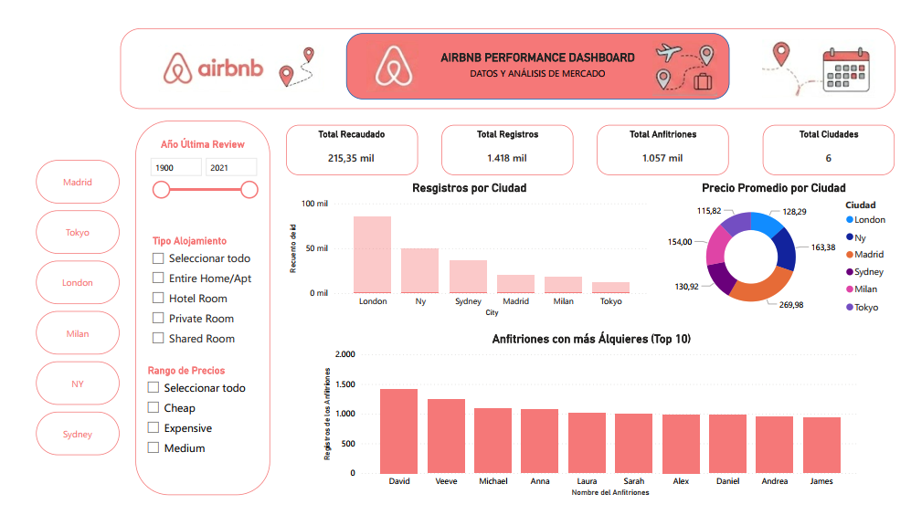
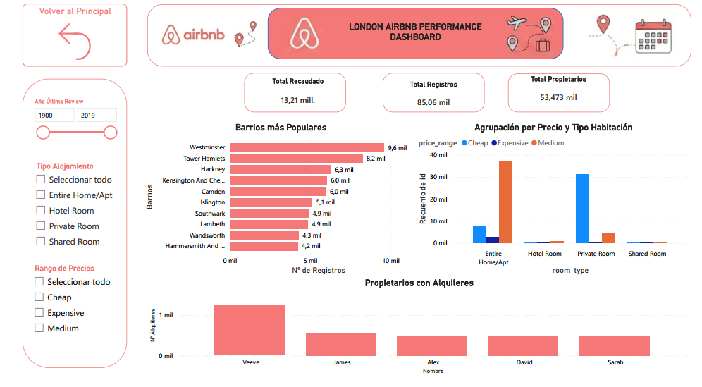
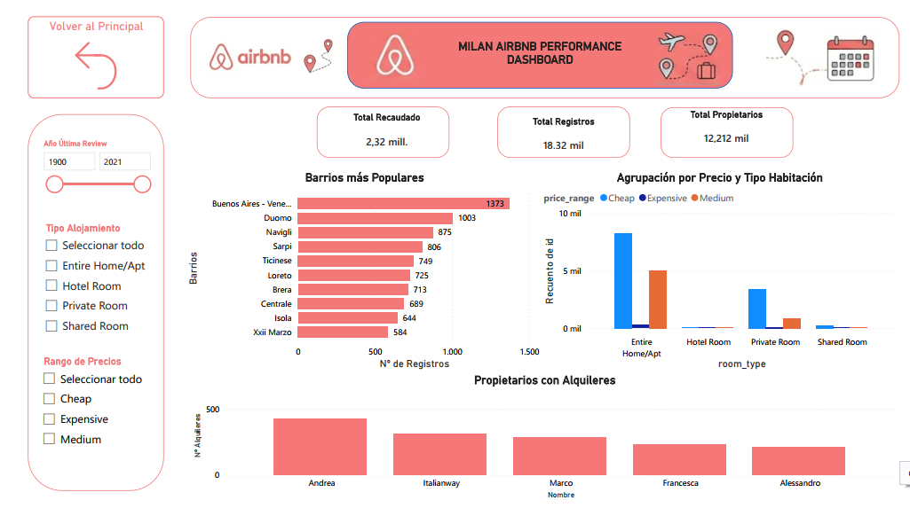

# DA_proyect_Analisis_PowerBI_grupo3
# 📊 Proyecto de Análisis de Datos: Airbnb Europe Performance

## 📋 Descripción del Proyecto
Este proyecto consiste en la unificación, limpieza profunda y modelado de datos de reservas de Airbnb en 6 ciudades europeas clave: London, Madrid, Milan, New York, Sydney y Tokyo. El objetivo principal fue consolidar archivos independientes en un modelo de datos optimizado bajo la arquitectura de **Estrella (Star Schema)** para garantizar un rendimiento eficiente y facilitar la posterior creación de dashboards en Power BI.

---

## 🎯 Objetivos del Proyecto e Hipótesis de Negocio

El desarrollo de este modelo de datos y sus posteriores dashboards interactivos se diseñó con el fin de responder a los siguientes objetivos estratégicos y validar tres hipótesis clave del mercado inmobiliario turístico:

### 1. Rentabilidad por Tipo de Alojamiento (`Room Type` vs. `Precio Promedio`)
* **Objetivo**: Evaluar qué tipologías de habitaciones generan mayor rentabilidad económica dentro de la plataforma.
* **Hipótesis**: Los precios por noche de los **apartamentos/casas completos** (`Entire home/apt`) son significativamente superiores en comparación con las **habitaciones privadas** (`Private room`), justificando la concentración de la oferta en esta categoría.

### 2. Brecha de Precios Intercontinental (`Ciudades Globales` vs. `Ciudades Europeas`)
* **Objetivo**: Cuantificar las diferencias de precio medio por noche entre los distintos mercados geográficos analizados.
* **Hipótesis**: El precio medio de los alquileres en grandes urbes y capitales financieras globales como **Nueva York y Londres** es drásticamente mayor en comparación con destinos culturales y turísticos europeos tradicionales como **Madrid o Milán**.

### 3. Análisis de Densidad Territorial y Concentración Geográfica (`Barrios`)
* **Objetivo**: Identificar patrones de distribución espacial de las propiedades disponibles para entender la saturación del mercado.
* **Hipótesis (Principio de Pareto)**: El **80% de la oferta total** de alojamientos se concentra estrictamente en los barrios correspondientes al **centro histórico y zonas turísticas neurálgicas** de cada ciudad, dejando las zonas periféricas o residenciales prácticamente desiertas.

---


## 🛠️ Tecnologías Utilizadas
* **Power BI / Power Query**: Extracción, transformación, carga (ETL) y modelado de datos.
* **Formatos de Origen**: Archivos de texto plano (.CSV).
* **Markdown**: Documentación del proyecto.

---

## 🔄 Proceso de ETL (Extracción, Transformación y Carga)

El ciclo de vida de los datos se dividió en dos fases críticas dentro de Power Query: la homogeneización de las fuentes individuales y la posterior estructuración de la tabla central de hechos.

### 1. Limpieza y Homogeneización de Orígenes (CSV Individuales)
Antes de la consolidación, cada archivo por ciudad (`london_airbnb`, `madrid_airbnb`, etc.) pasó por el siguiente tratamiento de calidad de datos:
* **Corrección estructural**: Eliminación de saltos de línea ocultos que corrompían las filas y el parsing de los archivos CSV originales.
* **Normalización financiera**: Conversión y estandarización de las monedas en la columna `price` a una escala homogénea.
* **Trazabilidad**: Creación de la columna descriptiva `city` en cada archivo de origen antes de realizar la unión.
* **Imputación de ausencias**: Manejo de valores nulos en fechas críticas asignando de forma temporal el año por defecto `1990` para evitar la pérdida de registros.

### 2. Pasos Aplicados en la Tabla Central (`Facts_airbnb`)
Una vez realizada la combinación de todas las ciudades con sus formatos y columnas sincronizadas, se ejecutó la siguiente secuencia de transformación en Power Query (según el histórico del editor):

* **Origen y Reemplazo**: Carga de la combinación inicial y ejecución de la sustitución de valores inconsistentes (`Valor reemplazado`).
* **Tratamiento de Texto**: 
  * Aplicación de mayúsculas en la primera letra de cada palabra (`Poner En Mayúsculas Cada Palabra`).
  * Limpieza de espacios en blanco innecesarios al inicio y final de las cadenas (`Texto recortado`).
  * Eliminación de caracteres invisibles o basura de los campos de texto (`Texto limpio`).
* **Enriquecimiento**: Incorporación de lógicas personalizadas y reglas de negocio mediante los pasos `Personalizada agregada` y `Columna condicional agregada`.
* **Construcción del Star Schema (Cruces)**:
  * Combinación y expansión sucesiva de las dimensiones externas para heredar únicamente las claves subrogadas/IDs necesarios (`Dim_City`, `Dim_RoomType`, `Dim_Date`, y `Dim_Neighbourhood`).
* **Depuración Final**:
  * **Columnas quitadas**: Eliminación definitiva de las columnas de negocio redundantes o fuera de alcance para optimizar el rendimiento (`neighbourhood_group`, `calculated_host_listings_count` y `availability_365`).
  * **Columnas con nombre cambiado**: Renombrado técnico de campos para asegurar un modelo autoexplicativo y fácil de leer.
  * **Redondeado**: Formateo numérico final de métricas y precios para su correcto almacenamiento y visualización.

---

## 📐 Modelado de Datos (Star Schema)

Para garantizar un rendimiento óptimo en las consultas del reporte, se transformó la estructura plana original en un **Modelo en Estrella**:

<pre>
        🌐 [Dim_City]           🛏️ [Dim_RoomType]
              \                       /
               \                     /
         ======[   Facts_Airbnb   ]======
               /                     \
              /                       \
        📅 [Dim_Date]           🏡 [Dim_Neighbourhood]
                             (Incluye Dim_Host)
</pre>

### Extracción de Dimensiones
Se aislaron las entidades del negocio eliminando estrictamente los registros duplicados para generar tablas de dimensiones con claves primarias únicas:

* **`Dim_City`**: Atributos `id_city` y `city` (Mapeo de las 6 ciudades europeas).
* **`Dim_RoomType`**: Atributos `room_type_id` y `room_type`.
* **`Dim_Neighbourhood`**: Atributos `neighbourhood_id` y `neighbourhood`.
* **`Dim_Host`**: Centralización de los identificadores de los anfitriones.
* **`Dim_Date`**: Tabla de tiempo construida a partir de la columna única `last_review`.
---

## 📊 Visualización de Datos (Dashboard en Power BI)

> 💡 *Instrucciones para el equipo: Para añadir las capturas de pantalla de su dashboard en GitHub, guardar las imágenes en una carpeta llamada `images` dentro de su repositorio y reemplacen la ruta `images/tu_captura.png`.*

### 🖥️ Dashboard Principal: Análisis Global de Mercado
El informe cuenta con un diseño intuitivo orientado al usuario de negocio, utilizando la paleta de colores corporativa de Airbnb. Incluye filtros interactivos por **Año de Última Review**, **Tipo de Alojamiento** y **Rango de Precios (Cheap, Medium, Expensive)**, además de un menú de navegación lateral para filtrar por ciudades específicas.



#### 📈 KPIs e Indicadores Clave Visibles:
* **Total Recaudado**: `31.93 Millones`
* **Total Registros**: `219,922 mil`
* **Total Anfitriones**: `144,448 mil`
* **Total Ciudades**: `6`

#### 📊 Análisis de los Gráficos Principales:
1. **Registros por Ciudad (Gráfico de Columnas)**: Distribución del volumen total de propiedades disponibles por mercado geográfico (Londres, NY, Sydney, Madrid, Milán, Tokyo).
2. **Precio Promedio por Ciudad (Gráfico de Anillo)**: Comparativa visual del costo medio por noche en cada una de las 6 ciudades analizadas.
3. **Anfitriones con más Alquileres - Top 10 (Gráfico de Columnas)**: Identificación de los principales "súper anfitriones" o cuentas con mayor volumen de propiedades listadas en la plataforma.

---

### 🗺️ Reportes Detallados por Ciudad
El informe se divide en pestañas específicas para un análisis en profundidad de cada mercado local:

#### 📍 Análisis del Mercado: Londres

*(Breve descripción del insight o KPI más importante descubierto en esta ciudad al terminar el análisis).*

#### 📍 Análisis del Mercado: Madrid

*(Breve descripción del insight o KPI más importante descubierto en esta ciudad al terminar el análisis).*

#### 📍 Análisis del Mercado: Milán

*(Breve descripción del insight o KPI más importante descubierto en esta ciudad al terminar el análisis).*

#### 📍 Análisis del Mercado: New York, Tokyo y Sydney
*(Espacio para añadir capturas o comentarios del resto de las ciudades desarrolladas en el informe).*

---

## 🧮 Fórmulas y Métricas DAX Clave

A continuación se detallan las medidas DAX principales desarrolladas para el cálculo de los indicadores del negocio:

```dax
// Reemplazar estos ejemplos con las fórmulas exactas que se crearon en Power BI
Total Recaudado = SUM(Facts_airbnb[price])
```

```dax
Total Registros = COUNTROWS(Facts_airbnb)
```

```dax
Precio Promedio = AVERAGE(Facts_airbnb[price])
```

---

## 🎯 Conclusiones del Análisis de Negocio

* **Insight 1 (Precios)**: *[Escribir aquí qué ciudad es la más costosa y por qué, basándose en el gráfico de anillo]*.
* **Insight 2 (Volumen de Mercado)**: *[Escribir aquí qué ciudad concentra la mayor cantidad de registros según el gráfico de columnas]*.
* **Insight 3 (Comportamiento de Oferta)**: *[Escribir aquí qué impacto tienen los Súper Anfitriones o el Top 10 en la concentración de alquileres]*.

---

## 👥 Integrantes del Equipo

* **Alejandra Duque García** - *[Rol en el proyecto, ej. Data Analyst / Data Engineer]* - [GitHub](https://github.com/ALEJANDRADG2612) | [LinkedIn](https://linkedin.com/in/aduquegarcia/)
* **Daniel Luque Gallardo** - *[Rol en el proyecto]* - [GitHub](https://github.com/daluga0503) | [LinkedIn](https://linkedin.com/in/daniel-luque-gallardo/)
* **Romina Navea Rodríguez** - *[Rol en el proyecto]* - [GitHub](https://github.com/rnavea-r) | [LinkedIn](https://linkedin.com/in/romina-navearod/)
